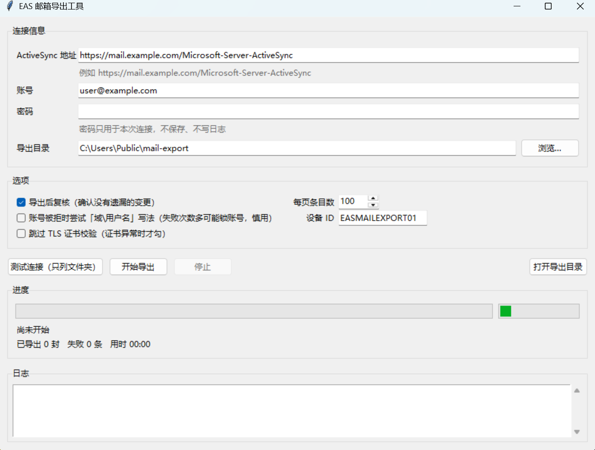

# EAS Mail Exporter

把整个邮箱导出成本地 `.eml` 文件：走 **Exchange ActiveSync**（手机邮件客户端用的那条通道），
不需要 Outlook，也不依赖任何第三方库。提供图形界面和命令行两种用法。



[](https://github.com/gunohaozheum/eas-mail-exporter/actions/workflows/tests.yml)


[English](#english) | [中文](#中文说明)

---

## English

### What it does

Connects to a mailbox over **Exchange ActiveSync (EAS)** and downloads every message
in every mail folder as a standalone `.eml` file — original MIME, all headers,
attachments included. It also writes a searchable `index.csv`, a `report.md`
summary and a resumable `state.json`.

It is useful when the usual routes are closed: many deployments disable IMAP/POP
ports and block `/EWS/*` (Exchange Web Services) at the firewall, while ActiveSync
stays open because phones rely on it.

### Features

* **GUI + CLI** — double-click `启动.bat` (Windows) or run `python app_gui.pyw`.
* **Zero dependencies** — only the Python standard library (`tkinter` + `urllib`).
* **Resumable** — per-folder sync keys are stored, so an interrupted run continues
  where it stopped instead of re-downloading.
* **Faithful output** — asks the server for the full MIME source; per-item fallback
  fetch when a folder returns summaries only. Anything that still fails is listed
  in `state.json` and `report.md` instead of being dropped silently.
* **Self-checking** — after the export it re-syncs every folder and reports whether
  any change is still pending. `tools/verify_export.py` re-reads every `.eml` file
  and validates headers, duplicates and index consistency.

### Requirements

* Python 3.9+ (tkinter included in the official installers; on Linux install
  `python3-tk`).
* A mailbox with ActiveSync enabled and basic authentication (no MFA prompt).

### Quick start (GUI)

1. Windows: double-click **`启动.bat`**. Other platforms: `python3 app_gui.pyw`.
2. Fill in the ActiveSync URL, for example
   `https://mail.example.com/Microsoft-Server-ActiveSync`.
3. Enter the account and password, pick an output folder, press **开始导出**.
4. Watch per-folder progress and the live log. Closing or cancelling is safe —
   re-running resumes.

The password is kept in memory only. It is never written to disk or to the log.

### Quick start (CLI)

```bash
python cli.py --url https://mail.example.com/Microsoft-Server-ActiveSync \
              --user you@example.com --out ~/mail-export --probe
```

`--probe` lists the folders without downloading anything. Drop it to export.
Useful flags: `--only 收件箱`, `--window-size 100`, `--no-verify`, `--insecure`,
`--verbose`.

### Output layout

```
<output folder>/
├─ eml/<folder path>/*.eml     original message per file
├─ index.csv                   folder, server id, date, from, subject, size, path
├─ state.json                  resume state (sync keys, exported ids, policy key)
├─ report.md                   per-folder summary and failure list
├─ verify-report.md            written by tools/verify_export.py
└─ logs/export-*.log           run logs
```

### Privacy and side effects

* The export folder holds your real mail. **Never commit it** — `.gitignore`
  already excludes `eml/`, `index.csv`, `state.json`, `report.md`, `logs/`.
* EAS registers a device in the mailbox (default id `EASMAILEXPORT01`). Remove it
  afterwards in Outlook Web App → Options → Phone / Mobile devices.
* Consider changing the mailbox password after exporting.

### How it works (and the quirks it handles)

The protocol is implemented from the public Microsoft specifications
([MS-ASHTTP], [MS-ASCMD], [MS-ASWBXML], [MS-ASPROV]). Several real-world quirks
are handled explicitly, each with a regression test:

| Quirk | Handling |
| --- | --- |
| Servers signal "device not provisioned" as HTTP 200 + body status `142` (not HTTP 449) | auto-detect and run the `Provision` handshake |
| `Provision` acknowledgement is rejected with `Status=2` when `<Policy>` children are ordered differently | try every documented ordering |
| `FolderSync` returns folders inside `<Changes><Add>` (not `<Folders><Folder>`) | parse the correct schema |
| Sending `<GetChanges/>` with `SyncKey=0` returns `Status=4` | omit it on the initial sync |
| Some servers only send items on the *second* sync pass | keep pulling until a pass returns nothing new |
| Empty HTTP 200 body means "no changes" on some servers | treat as an empty page instead of failing |
| `<Data>` payloads are not always clean base64 | try raw MIME, length-prefixed, padded, control-byte variants |
| `email.message_from_bytes` mangles raw UTF-8 headers | parse headers from bytes directly |

The WBXML tag tables in `eas/wbtokens.py` are generated from the official
[MS-ASWBXML] specification by `tools/fetch_ms-aswbxml_spec.py` + `tools/gen_wbtokens.py`.

### Tests

All tests are offline — no account and no network needed:

```bash
python tests/test_wbxml.py       # encoder matches Microsoft's byte-level example
python tests/test_requests.py    # request encoding for every command
python tests/test_responses.py   # response parsing for FolderSync/Sync/ItemOperations
python tests/test_headers.py     # RFC 2047 + raw UTF-8 header decoding
```

### Build a standalone .exe (optional)

Windows: run `build_exe.bat` (installs PyInstaller and produces
`dist/EAS Mail Exporter.exe`, no Python needed on the target machine).

### Limitations

* Mail folders only. Calendar, contacts, tasks and notes are reported and skipped
  (they cannot be represented as `.eml`).
* Requires ActiveSync to be enabled for the account; some tenants disable it or
  enforce MFA, in which case the connection fails with HTTP 401.
* First-time provisioning registers a device partnership in the mailbox.

### License

MIT — see [LICENSE](LICENSE). Replace the copyright placeholder with your own
name or GitHub handle before publishing.

---

## 中文说明

### 这是什么

通过 **Exchange ActiveSync**（手机邮件客户端使用的那条通道）把整个邮箱导出成本地
`.eml` 文件：每封一个文件，保留完整 MIME 原文、全部邮件头和附件；同时生成可搜索的
`index.csv` 索引、`report.md` 报告和可断点续传的 `state.json`。图形界面和命令行两种用法。

适用的典型场景：IMAP/POP 端口被关闭、`/EWS/*` 被防火墙按路径拦截（连接发出请求后
直接被重置），但 ActiveSync 因为手机端依赖而保持开放。

### 主要功能

* **图形界面 + 命令行**：Windows 下双击 `启动.bat` 即可；也可以 `python cli.py ...`。
* **零第三方依赖**：只用 Python 标准库（`tkinter` + `urllib`），不需要 pip 安装任何东西。
* **断点续传**：每个文件夹记录服务器返回的同步键，中断后重跑会接着来，不重复下载。
* **完整度高**：优先要求服务器内嵌完整 MIME；只给摘要的条目再单独补取；仍然拿不到的
  会记进失败清单并在报告里列出，不会静默丢弃。
* **自带核查**：导出结束后重新同步一遍确认没有遗漏；`tools/verify_export.py` 会逐封
  重新读取 `.eml`，检查头部、重复与索引一致性。

### 环境要求

* Python 3.9 及以上（官方安装包自带 tkinter；Linux 需另装 `python3-tk`）。
* 账号已启用 ActiveSync，且使用基础认证（没有额外的二次验证弹窗）。

### 快速开始（图形界面）

1. Windows 双击 **`启动.bat`**；其他系统运行 `python3 app_gui.pyw`。
2. 填写 ActiveSync 地址，例如 `https://mail.example.com/Microsoft-Server-ActiveSync`。
3. 填写账号、密码，选择导出目录，点 **开始导出**。
4. 界面会显示每个文件夹的进度和实时日志。随时可以停止，重跑即可续传。

密码只存在于内存里，既不写文件也不进日志。

### 快速开始（命令行）

```bash
python cli.py --url https://mail.example.com/Microsoft-Server-ActiveSync ^
              --user you@example.com --out D:\mail-export --probe
```

`--probe` 只列文件夹、不下载邮件；去掉它就是正式导出。常用参数：
`--only 收件箱`（只导某个文件夹）、`--window-size 100`、`--no-verify`、
`--insecure`、`--verbose`。

### 输出结构

```
<导出目录>/
├─ eml/<文件夹路径>/*.eml      每封邮件的原始 MIME
├─ index.csv                  索引：文件夹、服务器 ID、时间、发件人、主题、大小、路径
├─ state.json                 断点续传状态（同步键、已导出条目、设备策略 key）
├─ report.md                  各文件夹汇总与失败清单
├─ verify-report.md           由 tools/verify_export.py 生成
└─ logs/export-*.log          运行日志
```

### 隐私与副作用

* 导出目录里是你真实的邮件，**不要提交到 Git**。`.gitignore` 已经排除
  `eml/`、`index.csv`、`state.json`、`report.md`、`logs/`。
* EAS 登录会在邮箱里登记一台设备（默认 ID `EASMAILEXPORT01`），导出完成后可在
  OWA「选项 → 电话 / 移动设备」里删除。
* 建议导出完成后修改一次邮箱密码。

### 原理与已处理的兼容性问题

协议按微软公开规范实现（[MS-ASHTTP]、[MS-ASCMD]、[MS-ASWBXML]、[MS-ASPROV]）。
以下都是实测踩到的坑，每一条都有对应的回归测试：

| 现象 | 处理方式 |
| --- | --- |
| 服务器用 HTTP 200 + 正文状态 `142` 表示"设备未通过策略"（而不是 HTTP 449） | 自动识别并完成 `Provision` 设备策略握手 |
| `Provision` 确认请求因 `<Policy>` 子元素顺序不同被判协议错误（`Status=2`） | 依次尝试各种文档允许的写法 |
| `FolderSync` 的文件夹在 `<Changes><Add>` 里，而不是 `<Folders><Folder>` | 按正确结构解析 |
| `SyncKey=0` 时带 `<GetChanges/>` 会返回 `Status=4` | 首次同步不带该元素 |
| 有的服务器要到第二轮同步才下发条目 | 一直拉到"某一轮没有新条目"才停 |
| 空文件夹时 Sync 返回 HTTP 200 + 空响应体 | 按"无变更"处理而不是报错 |
| `<Data>` 内容不总是干净的 base64 | 依次尝试原始 MIME、带长度前缀、缺 `=`、带控制字节等形态 |
| `email.message_from_bytes` 会把未编码的 UTF-8 邮件头解成乱码 | 直接按字节解析邮件头 |

`eas/wbtokens.py` 里的字段表由 `tools/fetch_ms-aswbxml_spec.py` +
`tools/gen_wbtokens.py` 从微软官方规范生成。

### 测试

全部离线，不需要账号、不联网：

```bash
python tests/test_wbxml.py       # 编码结果与微软官方逐字节样例完全一致
python tests/test_requests.py    # 各命令的请求编码
python tests/test_responses.py   # FolderSync / Sync / ItemOperations 响应解析
python tests/test_headers.py     # RFC 2047 与原始 UTF-8 邮件头解码
```

### 打包成独立 exe（可选）

Windows 下运行 `build_exe.bat`，会自动安装 PyInstaller 并生成
`dist/EAS Mail Exporter.exe`，目标机器不需要装 Python。

### 已知限制

* 只导出邮件文件夹；日历、联系人、任务、便笺会被识别并跳过（它们不适合用 `.eml` 表示）。
* 需要账号已启用 ActiveSync；若服务器强制二次验证或关闭了 ActiveSync，会以 HTTP 401 失败。
* 首次连接会在邮箱里留下一条设备记录。

### 许可证

MIT，见 [LICENSE](LICENSE)。发布前请把其中的版权占位符换成你自己的名字或 GitHub 用户名。
